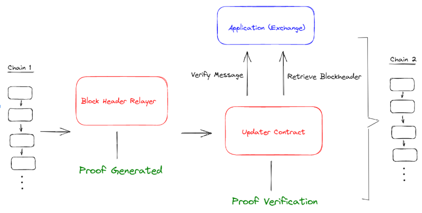
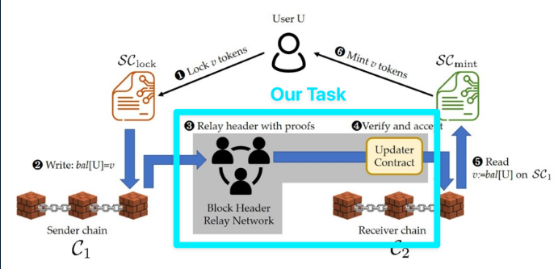

# zkBridge Updater Contract and Relayers

**Summary**: zkBridge is a secure and efficient cross-chain bridge built on zk-SNARKs. For our project, we built some core components of zkBridge – namely, the block header relayer, updater contract, and the message relayer. In this report we discuss zkBridge and detail our design and implementation for these components.



**Design**: Chain 1 is the source blockchain and Chain 2 is the target blockchain. The block header relayer monitors Chain 1. Each time a new block is added to Chain 1, the block header relayer generates a zk-SNARK for the block header and sends the block along with the zk-SNARK to the updater contract, a smart contract situated on Chain 2. The updater contract then verifies the zk-SNARK, and if the verification passes, stores the block header on Chain 2. When an application on Chain 2 wants to read a block header from Chain 1, it just needs to query the updater contract to fetch that block header. Applications can also verify the messages stored on Chain 1 by passing in the message as well as a Merkle proof for that message to the updater contract.



## Set up

**Prerequisites**: Before you begin, make sure you have Node.js and npm installed in your environment.
 
1. Clone the repository
```
git clone https://github.com/ProofPosse/zkbridge-relayers
```

2. Install npm libraries
```
npm i
```

3. Fill out .env file with Ethereum private key, Alchemy API, Updater Contract address, and networks

To start updater block header node:
```
node updateBlockHeader.js
node getBlockHeader.js <blockNumber>
```

## Tests

Install Ganache first and start local development chain

```
truffle test
```

To run linter:

```
solium -d .
```

## Contributing
- Ethan Chang (mv.echang@berkeley.edu)
- Edward Zeng (edwardzeng@berkeley.edu)
- Boyuan Deng (dengboyuan2001@berkeley.edu)
- Tony Hong (tshong@berkeley.edu)
- Michael Zhu (michaelwzhu@berkeley.edu)

